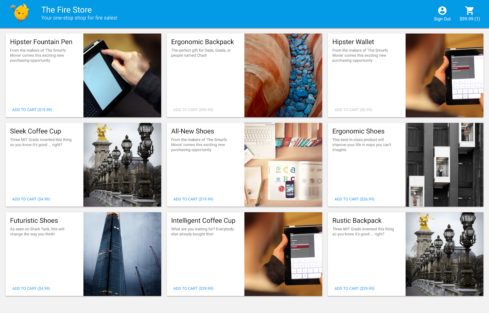
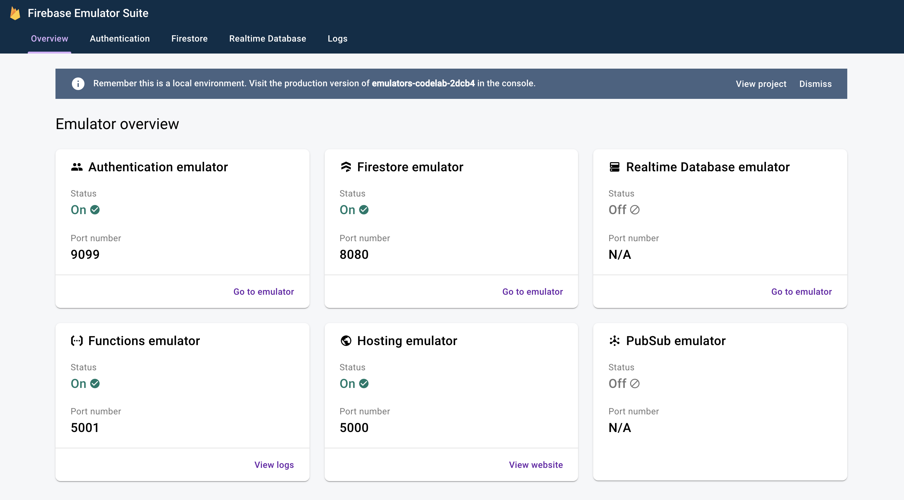
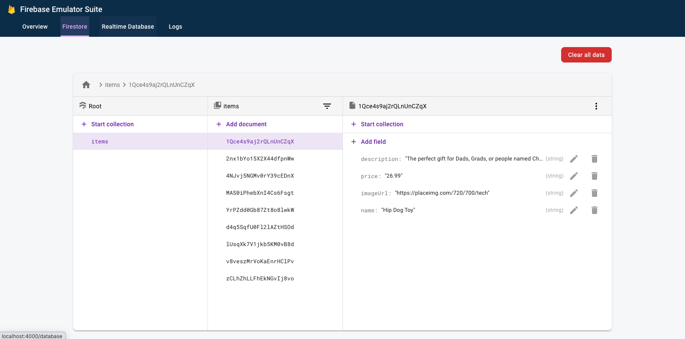
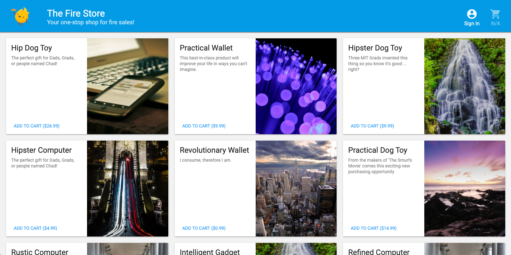
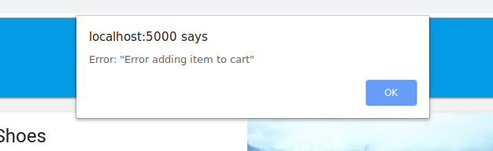
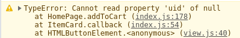
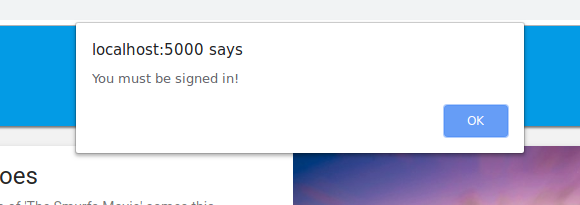
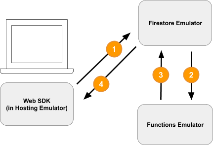
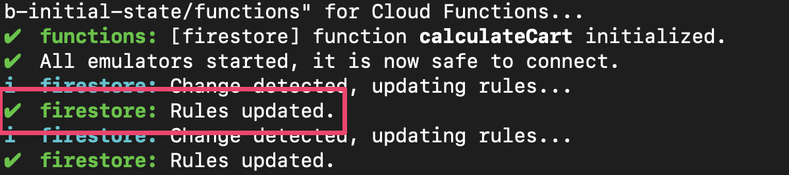
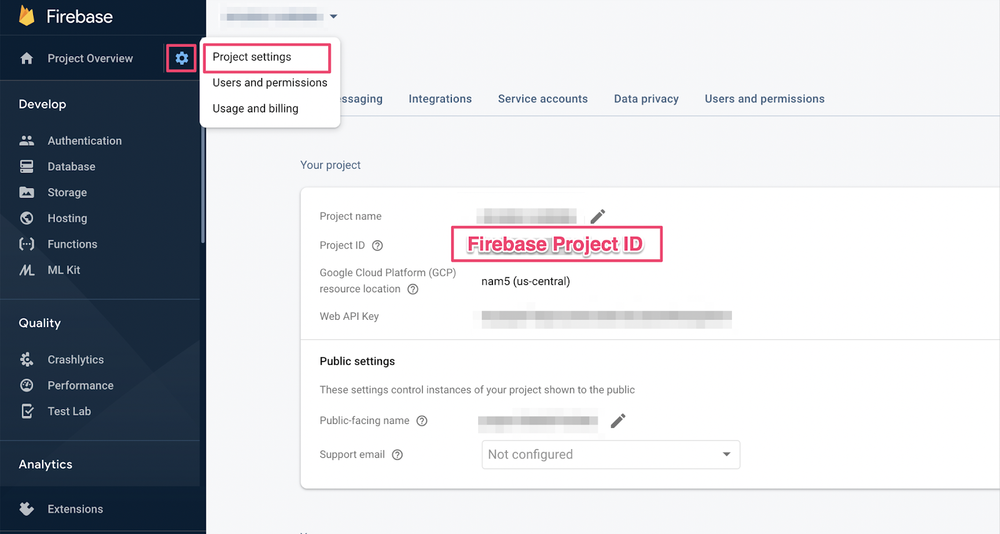

# Local Development with the Firebase Emulator Suite

## Before you begin

> aside negative
This codelab uses v8 of the Firebase JavaScript SDKs. It is recommended that you use
v9 for your applications. This codelab will soon be updated to v9. The concepts
described in this codelab are still valid. See Firebase documentation to
[learn more about SDK versions 8 and 9](https://firebase.google.com/docs/web/learn-more?authuser=0#modular-version).

Serverless backend tools like Cloud Firestore and Cloud Functions are very easy to use, but can be hard to test.  The Firebase Local Emulator Suite allows you to run local versions of these services on your development machine so you can develop your app quickly and safely.

### **Prerequisites**

* A simple editor such as Visual Studio Code, Atom, or Sublime Text
* Node.js 10.0.0 or higher (to install Node.js,  [use nvm](https://github.com/nvm-sh/nvm#installation-and-update), to check your version, run `node --version`)
* Java 7 or higher (to install Java  [use these instructions](https://java.com/en/download/help/download_options.xml), to check your version, run `java -version`)

### **What you'll do**

In this codelab, you will run and debug a simple online shopping app which is powered by multiple Firebase services:

* **Cloud Firestore:** a globally scalable, serverless, NoSQL database with real-time capabilities. 
* **Cloud Functions**: a serverless backend code that runs in response to events or HTTP requests.  
* **Firebase Authentication**: a managed authentication service that integrates with other Firebase products.
* **Firebase Hosting**: fast and secure hosting for web apps. 

You will connect the app to the Emulator Suite to enable local development.



You'll also learn how to:

* How to connect your app to the Emulator Suite and how the various emulators are connected.
* How Firebase Security Rules work and how to test Firestore Security Rules against a local emulator.
* How to write a Firebase Function that is triggered by Firestore events and how to write integration tests that runs against the Emulator Suite.


## Set up
Duration: 04:00

### **Get the source code**

In this codelab, you start off with a version of The Fire Store sample that is nearly complete, so the first thing you need to do is clone the source code:

```console
$ git clone https://github.com/firebase/emulators-codelab.git
```

Then move into the codelab directory, where you will work for the remainder of this codelab:

```console
$ cd emulators-codelab/codelab-initial-state
```

Now, install the dependencies so you can run the code. If you're on a slower internet connection this may take a minute or two:

```shell
# Move into the functions directory
$ cd functions

# Install dependencies
$ npm install

# Move back into the previous directory
$ cd ../
```

### **Get the Firebase CLI**

The Emulator Suite is part of the Firebase CLI (command-line interface) which can be installed on your machine with the following command:

```console
$ npm install -g firebase-tools
```

Next, confirm that you have the latest version of the CLI.  This codelab should work with version 9.0.0 or higher but later versions include more bug fixes.

```console
$ firebase --version
9.6.0
```

### Connect to your Firebase project

If you don't have a Firebase project, in the  [Firebase console](https://console.firebase.google.com/), create a new Firebase project.  Make a note of the Project ID you choose, you will need it later.

Now we need to connect this code to your Firebase project. 
First run the following command to log in to the Firebase CLI:

```console
$ firebase login
```

Next run the following command to create a project alias. Replace `$YOUR_PROJECT_ID` with the ID of your Firebase project.

```console
$ firebase use $YOUR_PROJECT_ID
```

Now you're ready to run the app!

## Run the emulators
Duration: 03:00

In this section, you'll run the app locally.  This means it is time to boot up the Emulator Suite.

#### **Start the Emulators**

From inside the codelab source directory, run the following command to start the emulators:

```console
$ firebase emulators:start --import=./seed
```

You should see some output like this:

```console
$ firebase emulators:start --import=./seed
i  emulators: Starting emulators: auth, functions, firestore, hosting
⚠  functions: The following emulators are not running, calls to these services from the Functions emulator will affect production: database, pubsub
i  firestore: Importing data from /Users/samstern/Projects/emulators-codelab/codelab-initial-state/seed/firestore_export/firestore_export.overall_export_metadata
i  firestore: Firestore Emulator logging to firestore-debug.log
i  hosting: Serving hosting files from: public
✔  hosting: Local server: http://127.0.0.1:5000
i  ui: Emulator UI logging to ui-debug.log
i  functions: Watching "/Users/samstern/Projects/emulators-codelab/codelab-initial-state/functions" for Cloud Functions...
✔  functions[calculateCart]: firestore function initialized.

┌─────────────────────────────────────────────────────────────┐
│ ✔  All emulators ready! It is now safe to connect your app. │
│ i  View Emulator UI at http://127.0.0.1:4000                │
└─────────────────────────────────────────────────────────────┘

┌────────────────┬────────────────┬─────────────────────────────────┐
│ Emulator       │ Host:Port      │ View in Emulator UI             │
├────────────────┼────────────────┼─────────────────────────────────┤
│ Authentication │ 127.0.0.1:9099 │ http://127.0.0.1:4000/auth      │
├────────────────┼────────────────┼─────────────────────────────────┤
│ Functions      │ 127.0.0.1:5001 │ http://127.0.0.1:4000/functions │
├────────────────┼────────────────┼─────────────────────────────────┤
│ Firestore      │ 127.0.0.1:8080 │ http://127.0.0.1:4000/firestore │
├────────────────┼────────────────┼─────────────────────────────────┤
│ Hosting        │ 127.0.0.1:5000 │ n/a                             │
└────────────────┴────────────────┴─────────────────────────────────┘
  Emulator Hub running at 127.0.0.1:4400
  Other reserved ports: 4500

Issues? Report them at https://github.com/firebase/firebase-tools/issues and attach the *-debug.log files.
```

Once you see the **All emulators started** message, the app is ready to use.

> aside positive
> 
> **Aside: What just happened?**
> 
> * Each emulator started up on 127.0.0.1, each one is running on a different port.
> * The Firestore emulator imported data from the `seed` directory, which is provided to make this codelab simpler.
> * The Functions emulator noticed the `calculateCart` function and notified the Firestore emulator.
> * The Functions emulator is now watching the `functions` directory for code changes.

#### **Connect the web app to the emulators**

Based on the table in the logs we can see that the the Cloud Firestore emulator is listening on port `8080` and the Authentication emulator is listening on port `9099`.

```console
┌────────────────┬────────────────┬─────────────────────────────────┐
│ Emulator       │ Host:Port      │ View in Emulator UI             │
├────────────────┼────────────────┼─────────────────────────────────┤
│ Authentication │ 127.0.0.1:9099 │ http://127.0.0.1:4000/auth      │
├────────────────┼────────────────┼─────────────────────────────────┤
│ Functions      │ 127.0.0.1:5001 │ http://127.0.0.1:4000/functions │
├────────────────┼────────────────┼─────────────────────────────────┤
│ Firestore      │ 127.0.0.1:8080 │ http://127.0.0.1:4000/firestore │
├────────────────┼────────────────┼─────────────────────────────────┤
│ Hosting        │ 127.0.0.1:5000 │ n/a                             │
└────────────────┴────────────────┴─────────────────────────────────┘
```

Let's connect your frontend code to the emulator, rather than to production. Open the `public/js/homepage.js` file and find the `onDocumentReady` function. We can see that the code accesses the standard Firestore and Auth instances:

**public/js/homepage.js**

```
  const auth = firebaseApp.auth();
  const db = firebaseApp.firestore();
```

Let's update the `db` and `auth` objects to point to the local emulators:

**public/js/homepage.js**

```  
  const auth = firebaseApp.auth();
  const db = firebaseApp.firestore();

  // ADD THESE LINES
  if (location.hostname === "127.0.0.1") {
    console.log("127.0.0.1 detected!");
    auth.useEmulator("http://127.0.0.1:9099");
    db.useEmulator("127.0.0.1", 8080);
  }
```

Now when the app is running on your local machine (served by the Hosting emulator) the Firestore client also points at the local emulator rather than at a production database.

#### **Open the EmulatorUI**

In your web browser, navigate to  [http://127.0.0.1:4000/](http://127.0.0.1:4000/). You should see the Emulator Suite UI.



Click to see the UI for the Firestore Emulator. The `items` collection already contains data because of the data imported with the `--import` flag.




## Run the app
Duration: 02:00


#### **Open the app**

In your web browser, navigate to  [http://127.0.0.1:5000](http://127.0.0.1:5000) and you should see The Fire Store running locally on your machine!



#### **Use the app**

Pick an item on the homepage and click **Add to Cart**.  Unfortunately, you will run into the following error:



Let's fix that bug!  Because everything is running in the emulators, we can experiment and not worry about affecting real data.


## Debug the app
Duration: 02:00


#### **Find the bug**

Ok let's look in the Chrome developer console. Press `Control+Shift+J` (Windows, Linux, Chrome OS) or `Command+Option+J` (Mac) to  see the error on the console:



It seems like there was some error in the `addToCart` method, let's take a look at that.  Where do we try to access something called `uid` in that method and why would it be `null`?  Right now the method looks like this in `public/js/homepage.js`:

**public/js/homepage.js**

```
  addToCart(id, itemData) {
    console.log("addToCart", id, JSON.stringify(itemData));
    return this.db
      .collection("carts")
      .doc(this.auth.currentUser.uid)
      .collection("items")
      .doc(id)
      .set(itemData);
  }
```

Aha!  We're not signed into the app. According to  [the Firebase Authentication docs](https://firebase.google.com/docs/reference/js/firebase.auth.Auth.html#currentuser), when we are not signed in, `auth.currentUser` is `null`.  Let's add a check for that:

**public/js/homepage.js**

```
  addToCart(id, itemData) {
    // ADD THESE LINES
    if (this.auth.currentUser === null) {
      this.showError("You must be signed in!");
      return;
    }

    // ...
  }
```

#### **Test the app**

Now, **refresh** the page and then click **Add to Cart**.  You should get a nicer error this time:



But if you click **Sign In** in the upper toolbar and then click **Add to Cart** again, you will see that the cart is updated. 

> aside negative
> 
> **Note**: For demonstration purposes, this application exclusively uses [**Anonymous Authentication**](https://firebase.google.com/docs/auth/web/anonymous-auth). Anonymous Auth assigns each session-user an ID that uniquely identifies them to the backend. It enables you to create an onboarding experience that doesn't require users to create a permanent account immediately. In production applications, to save user data across sessions and devices, you'll need to convert users from Anonymous Auth to another sign in method.

However, it doesn't look like the numbers are correct at all:


Don't worry, we'll fix that bug soon.  First, let's dive deep into what actually happened when you added an item to your cart.


## Local functions triggers
Duration: 02:00


Clicking **Add to Cart** kicks off a chain of events that involve multiple emulators.  In the Firebase CLI logs, you should see something like the following messages after you add an item to your cart:

```console
i  functions: Beginning execution of "calculateCart"
i  functions: Finished "calculateCart" in ~1s
```

There were four key events that occurred to produce those logs and the UI update you observed:



> aside positive
> 
> **Note**: You don't need to update your app with the code snippets below. The code is already included in the app. The code snippets  in this section are only presented to help you understand the four key events.

**1) Firestore Write - Client**

A new document is added to the Firestore collection `/carts/{cartId}/items/{itemId}/`. You can see this code in the `addToCart` function inside `public/js/homepage.js`:

**public/js/homepage.js**

```
  addToCart(id, itemData) {
    // ...
    console.log("addToCart", id, JSON.stringify(itemData));
    return this.db
      .collection("carts")
      .doc(this.auth.currentUser.uid)
      .collection("items")
      .doc(id)
      .set(itemData);
  }
```

**2) Cloud Function Triggered**

The Cloud Function `calculateCart` listens for any write events (create, update, or delete) that happen to cart items by using the `onWrite` trigger, which you can see in `functions/index.js`:

**functions/index.js**

```
exports.calculateCart = functions.firestore
    .document("carts/{cartId}/items/{itemId}")
    .onWrite(async (change, context) => {
      try {
        let totalPrice = 125.98;
        let itemCount = 8;

        const cartRef = db.collection("carts").doc(context.params.cartId);

        await cartRef.update({
          totalPrice,
          itemCount
        });
      } catch(err) {
      }
    }
);
```

**3) Firestore Write - Admin**

The `calculateCart` function reads all of the items in the cart and adds up the total quantity and price, then it updates the "cart" document with the new totals (see `cartRef.update(...)` above).

**4) Firestore Read - Client**

The web frontend is subscribed to receive updates about changes to the cart.  It gets a real-time update after the Cloud Function writes the new totals and updates the UI, as you can see in `public/js/homepage.js`:

**public/js/homepage.js**

```
this.cartUnsub = cartRef.onSnapshot(cart => {
   // The cart document was changed, update the UI
   // ...
});
```

### **Recap**

Nice work!  You just set up a fully local app that uses three different Firebase emulators for fully local testing.


But wait, there's more!  In the next section you'll learn:

* How to write unit tests that use the Firebase Emulators.
* How to use the Firebase Emulators to debug your Security Rules.


## Create security rules tailored for your app
Duration: 01:00


Our web app reads and writes data but so far we haven't really worried about security at all.  Cloud Firestore uses a system called "Security Rules" to declare who has access to read and write data.  The Emulator Suite is a great way to prototype these rules.

In the editor, open the file `emulators-codelab/codelab-initial-state/firestore.rules`. You'll see that we have three main sections in our rules:

```
rules_version = '2';
service cloud.firestore {
  match /databases/{database}/documents {
    // User's cart metadata
    match /carts/{cartID} {
      // TODO: Change these! Anyone can read or write.
      allow read, write: if true;
    }

    // Items inside the user's cart
    match /carts/{cartID}/items/{itemID} {
      // TODO: Change these! Anyone can read or write.
      allow read, write: if true;
    }

    // All items available in the store. Users can read
    // items but never write them.
    match /items/{itemID} {
      allow read: if true;
    }
  }
}
```

Right now anyone can read and write data to our database!  We want to make sure that only valid operations get through and that we don't leak any sensitive information.

During this codelab, following the Principle of Least Privilege, we'll lock down all the documents and gradually add access until all the users have all the access they need, but not more. Let's update the first two rules to deny access by setting the condition to `false`:

```
rules_version = '2';
service cloud.firestore {
  match /databases/{database}/documents {
    // User's cart metadata
    match /carts/{cartID} {
      // UPDATE THIS LINE
      allow read, write: if false;
    }

    // Items inside the user's cart
    match /carts/{cartID}/items/{itemID} {
      // UPDATE THIS LINE
      allow read, write: if false;
    }

    // All items available in the store. Users can read
    // items but never write them.
    match /items/{itemID} {
      allow read: if true;
    }
  }
}
```

> aside positive
> 
> **Aside: What if there are no match statements for an operation?**
> 
> * Rules deny by default. If an operation does not match any rules defined in the rules file, access will be denied.
> * Locked mode, or Production mode, is making that implicit denial an explicit denial by matching all documents and denying all access.


## Run the emulators and tests
Duration: 02:00


### **Start the emulators**

On the command line, make sure you're in `emulators-codelab/codelab-initial-state/`. You may still have the emulators running from the previous steps. If not, start the emulators again:

```console
$ firebase emulators:start --import=./seed
```

Once the emulators are running, you can run tests locally against them. 

### **Run the tests**

On the command line **in a new terminal tab** from the directory `emulators-codelab/codelab-initial-state/`

First move into the functions directory (we'll stay here for the remainder of the codelab):

```console
$ cd functions
```

Now run the mocha tests in the functions directory, and scroll to the top of the output:

```console
# Run the tests
$ npm test

> functions@ test .../emulators-codelab/codelab-initial-state/functions
> mocha

  shopping carts
    1) can be created and updated by the cart owner
    2) can be read only by the cart owner

  shopping cart items
    3) can be read only by the cart owner
    4) can be added only by the cart owner

  adding an item to the cart recalculates the cart total. 
    - should sum the cost of their items


  0 passing (364ms)
  1 pending
  4 failing
```

Right now we have four failures. As you build the rules file, you can measure progress by watching more tests pass.


## Secure cart access
Duration: 05:00


The first two failures are the "shopping cart" tests which test that:

* Users can only create and update their own carts
* Users can only read their own carts

**functions/test.js**

```
  it('can be created and updated by the cart owner', async () => {
    // Alice can create her own cart
    await firebase.assertSucceeds(aliceDb.doc("carts/alicesCart").set({
      ownerUID: "alice",
      total: 0
    }));

    // Bob can't create Alice's cart
    await firebase.assertFails(bobDb.doc("carts/alicesCart").set({
      ownerUID: "alice",
      total: 0
    }));

    // Alice can update her own cart with a new total
    await firebase.assertSucceeds(aliceDb.doc("carts/alicesCart").update({
      total: 1
    }));

    // Bob can't update Alice's cart with a new total
    await firebase.assertFails(bobDb.doc("carts/alicesCart").update({
      total: 1
    }));
  });

  it("can be read only by the cart owner", async () => {
    // Setup: Create Alice's cart as admin
    await admin.doc("carts/alicesCart").set({
      ownerUID: "alice",
      total: 0
    });

    // Alice can read her own cart
    await firebase.assertSucceeds(aliceDb.doc("carts/alicesCart").get());

    // Bob can't read Alice's cart
    await firebase.assertFails(bobDb.doc("carts/alicesCart").get());
  });
```

Let's make these tests pass. In the editor, open the security rules file, `firestore.rules`, and update the statements within  `match /carts/{cartID}`:

**firestore.rules**

```
rules_version = '2';
service cloud.firestore {
    // UPDATE THESE LINES
    match /carts/{cartID} {
      allow create: if request.auth.uid == request.resource.data.ownerUID;
      allow read, update, delete: if request.auth.uid == resource.data.ownerUID;
    }

    // ...
  }
}
```

These rules now only allow read and write access by the cart owner.

To verify incoming data and user's authentication, we use two objects that are available in the context of every rule:

* The  [`request`](https://firebase.google.com/docs/reference/rules/rules.firestore.html#request) object contains data and metadata about the operation that is being attempted.
* If a Firebase project is using  [Firebase Authentication](https://firebase.google.com/docs/auth), the  [`request.auth`](https://firebase.google.com/docs/reference/rules/rules.firestore.Request.html#auth) object describes the user who is making the request. 

> aside positive
> 
> **What are the key differences between** **`resource`** **and**  **`request.resource`****?**
> 
> * `resource`: Represents the Firestore document in question before the current request. So for a *create* request, `resource.data` is always `null` because the document does not yet exist.
> * `request.resource`: Represents the Firestore document with the changes that the user wants to write.  So for a *create* request, `request.resource.data` contains the proposed document.


## Test cart access
Duration: 02:00


The Emulator Suite automatically updates the rules whenever `firestore.rules` is saved. You can confirm that the emulator has the updated the rules by looking in the  tab running the emulator for the message `Rules updated`:



Rerun the tests, and check that the first two tests now pass:

```console
$ npm test

> functions@ test .../emulators-codelab/codelab-initial-state/functions
> mocha

  shopping carts
    ✓ can be created and updated by the cart owner (195ms)
    ✓ can be read only by the cart owner (136ms)

  shopping cart items
    1) can be read only by the cart owner
    2) can be added only by the cart owner

  adding an item to the cart recalculates the cart total. 
    - should sum the cost of their items

  2 passing (482ms)
  1 pending
  2 failing
```

Good job! You have now secured access to shopping carts.  Let's move on to the next failing test.


## Check the "Add to Cart" flow in the UI
Duration: 02:00


Right now, although cart owners read and write to their cart, they can't read or write individual items in their cart. That's because while owners have access to the cart document, they don't have access to the cart's *items subcollection*. 

> aside positive
> 
> **Aside: Rules don't cascade over subcollections**
> 
> * By default, the rules for a document don't cascade to documents in a subcollection.
> * It's common to want slightly different rules for documents in a subcollection.
> * If you want the documents in a subcollection to have the exact same rules, you can use the glob syntax to match all documents recursively: **`match /{cartId=**}`** (do this with care).

This is a broken state for users. 

Return to the web UI, which is running on `http://127.0.0.1:5000,` and try to add something to your cart. You get a `Permission Denied` error, visible from the debug console, because we haven't yet granted users access to created documents in the *`items`* subcollection.


## Allow cart items access
Duration: 02:00


These two tests confirm that users can only add items to or read items from their own cart:

```
  it("can be read only by the cart owner", async () => {
    // Alice can read items in her own cart
    await firebase.assertSucceeds(aliceDb.doc("carts/alicesCart/items/milk").get());

    // Bob can't read items in alice's cart
    await firebase.assertFails(bobDb.doc("carts/alicesCart/items/milk").get())
  });

  it("can be added only by the cart owner",  async () => {
    // Alice can add an item to her own cart
    await firebase.assertSucceeds(aliceDb.doc("carts/alicesCart/items/lemon").set({
      name: "lemon",
      price: 0.99
    }));

    // Bob can't add an item to alice's cart
    await firebase.assertFails(bobDb.doc("carts/alicesCart/items/lemon").set({
      name: "lemon",
      price: 0.99
    }));
  });
```


So we can write a rule that allows access if the current user has the same UID as the ownerUID on the cart document. Since there's no need to specify different rules for `create, update, delete`, you can use a `write` rule, which applies to all requests that modify data. 

Update the rule for the documents in the items subcollection. The `get` in the conditional is reading a value from Firestore–in this case, the `ownerUID` on the cart document.

```
rules_version = '2';
service cloud.firestore {
  match /databases/{database}/documents {
    // ...

    // UPDATE THESE LINES
    match /carts/{cartID}/items/{itemID} {
      allow read, write: if get(/databases/$(database)/documents/carts/$(cartID)).data.ownerUID == request.auth.uid;
    }

    // ...
  }
}
```

> aside positive
> 
> **Aside: When can you use a resource or make a get call?**
> 
> * You can use the `resource` object when the required data is part of the current document being read/written.
> * If you need data outside the current document, use a `get` statement. Note that these operations count towards your Firestore bill!


## Test cart items access
Duration: 02:00


Now we can rerun the test. Scroll to the top of the output and check that more tests pass:

```console
$ npm test

> functions@ test .../emulators-codelab/codelab-initial-state/functions
> mocha

  shopping carts
    ✓ can be created and updated by the cart owner (195ms)
    ✓ can be read only by the cart owner (136ms)

  shopping cart items
    ✓ can be read only by the cart owner (111ms)
    ✓ can be added only by the cart owner


  adding an item to the cart recalculates the cart total. 
    - should sum the cost of their items


  4 passing (401ms)
  1 pending
```

Nice! Now all of our tests pass. We have one pending test, but we'll get to that in a few steps.


## Check the "add to cart" flow again
Duration: 02:00


Return to the web front end ( [http://127.0.0.1:5000](http://127.0.0.1:5000)) and add an item to the cart. This is an important step to confirm that our tests and rules match the functionality required by the client. (Remember that the last time we tried out the UI users were unable to add items to their cart!)


The client automatically reloads the rules when the `firestore.rules` is saved. So, try adding something to the cart.

### **Recap**

Nice work! You just improved the security of your app, an essential step for getting it ready for production!  If this were a production app, we could add these tests to our continuous integration pipeline. This would give us confidence going forward that our shopping cart data will have these access controls, even if others are modifying the rules. 


**But wait, there's more!**

if you continue on you'll learn:

* How to write a function triggered by a Firestore event
* How to create tests that work across multiple emulators


## Set up Cloud Functions tests
Duration: 01:00


So far we've focused on the frontend of our web app and the Firestore Security Rules.  But this app also uses Cloud Functions to keep the user's cart up to date, so we want to test that code as well.

The Emulator Suite makes it so easy to test Cloud Functions, even functions that use Cloud Firestore and other services.

In the editor, open the `emulators-codelab/codelab-initial-state/functions/test.js` file and scroll to the last test in the file. Right now, it's marked as pending:

```
//  REMOVE .skip FROM THIS LINE
describe.skip("adding an item to the cart recalculates the cart total. ", () => {
  // ...

  it("should sum the cost of their items", async () => {
    ...
  });
});
```

To enable the test, remove `.skip`, so it looks like this:

```
describe("adding an item to the cart recalculates the cart total. ", () => {
  // ...

  it("should sum the cost of their items", async () => {
    ...
  });
});
```

Next, find the `REAL_FIREBASE_PROJECT_ID` variable at the top of the file and change it to your real Firebase Project ID.:

```
// CHANGE THIS LINE
const REAL_FIREBASE_PROJECT_ID = "changeme";
```

If you forgot your project ID you can find your Firebase Project ID in the Project Settings in the Firebase Console:




## Walk through Functions tests
Duration: 05:00


Because this test validates the interaction between Cloud Firestore and Cloud Functions, it involves more setup than the tests in the previous codelabs. Let's walk through this test and get an idea of what it expects.

> aside positive
> 
> **Note**: The code snippets below are meant to help you read and understand the code that's already written. In this step, you don't have to change the app at all!

**Create a cart**

Cloud Functions run in a trusted server environment and can use the service account authentication used by the Admin SDK . First, you initialize an app using `initializeAdminApp` instead of `initializeApp`. Then, you create a  [DocumentReference](https://cloud.google.com/nodejs/docs/reference/firestore/0.8.x/DocumentReference) for the cart we'll be adding items to and initialize the cart:

```
it("should sum the cost of their items", async () => {
    const db = firebase
        .initializeAdminApp({ projectId: REAL_FIREBASE_PROJECT_ID })
        .firestore();

    // Setup: Initialize cart
    const aliceCartRef = db.doc("carts/alice")
    await aliceCartRef.set({ ownerUID: "alice", totalPrice: 0 });

    ...
  });
```

**Trigger the function**

Then, add documents to the `items` subcollection of our cart document in order to trigger the function. Add two items to make sure you're testing the addition that happens in the function.

```
it("should sum the cost of their items", async () => {
    const db = firebase
        .initializeAdminApp({ projectId: REAL_FIREBASE_PROJECT_ID })
        .firestore();

    // Setup: Initialize cart
    const aliceCartRef = db.doc("carts/alice")
    await aliceCartRef.set({ ownerUID: "alice", totalPrice: 0 });

    //  Trigger calculateCart by adding items to the cart
    const aliceItemsRef = aliceCartRef.collection("items");
    await aliceItemsRef.doc("doc1").set({name: "nectarine", price: 2.99});
    await aliceItemsRef.doc("doc2").set({ name: "grapefruit", price: 6.99 });

    ...
    });
  });
```

**Set test expectations** 


Use `onSnapshot()` to register a listener for any changes on the cart document. `onSnapshot()` returns a function that you can call to unregister the listener.

> aside positive
> 
> **Why listen to the cart document rather than a document in the items subcollection?**
> 
> Although the function is triggered by write operations in the `items` subcollection, the function then updates the cart document. That is a side effect of the initial write that we want to test.

For this test, add two items that together cost $9.98. Then, check if the cart has the expected `itemCount` and `totalPrice`. If so, then the function did its job.

```
it("should sum the cost of their items", (done) => {
    const db = firebase
        .initializeAdminApp({ projectId: REAL_FIREBASE_PROJECT_ID })
        .firestore();

    // Setup: Initialize cart
    const aliceCartRef = db.doc("carts/alice")
    aliceCartRef.set({ ownerUID: "alice", totalPrice: 0 });

    //  Trigger calculateCart by adding items to the cart
    const aliceItemsRef = aliceCartRef.collection("items");
    aliceItemsRef.doc("doc1").set({name: "nectarine", price: 2.99});
    aliceItemsRef.doc("doc2").set({ name: "grapefruit", price: 6.99 });
    
    // Listen for every update to the cart. Every time an item is added to
    // the cart's subcollection of items, the function updates `totalPrice`
    // and `itemCount` attributes on the cart.
    // Returns a function that can be called to unsubscribe the listener.
    await new Promise((resolve) => {
      const unsubscribe = aliceCartRef.onSnapshot(snap => {
        // If the function worked, these will be cart's final attributes.
        const expectedCount = 2;
        const expectedTotal = 9.98;
  
        // When the `itemCount`and `totalPrice` match the expectations for the
        // two items added, the promise resolves, and the test passes.
        if (snap.data().itemCount === expectedCount && snap.data().totalPrice == expectedTotal) {
          // Call the function returned by `onSnapshot` to unsubscribe from updates
          unsubscribe();
          resolve();
        };
      });
    });
   });
 });
```


## Run the tests
Duration: 02:00


You might still have the emulators running from the previous tests. If not, start the emulators. From the command line, run

```console
$ firebase emulators:start --import=./seed
```

Open a **new terminal tab** (leave the emulators running) and move into the functions directory.  You might still have this open from the security rules tests.

```console
$ cd functions
```

Now run the unit tests, you should see 5 total tests:

```console
$ npm test

> functions@ test .../emulators-codelab/codelab-initial-state/functions
> mocha

  shopping cart creation
    ✓ can be created by the cart owner (82ms)

  shopping cart reads, updates, and deletes
    ✓ cart can be read by the cart owner (42ms)

  shopping cart items
    ✓ items can be read by the cart owner (40ms)
    ✓ items can be added by the cart owner

  adding an item to the cart recalculates the cart total. 
    1) should sum the cost of their items

  4 passing (2s)
  1 failing
```

If you look at the specific failure, it appears to be a timeout error. This is because the test is waiting for the function to correctly update, but it never does. Now, we're ready to write the function to satisfy the test.


## Write a function
Duration: 02:00


To fix this test, you need to update the function in `functions/index.js`. Although some of this function is written, it's not complete. This is how the function currently looks:

```
// Recalculates the total cost of a cart; triggered when there's a change
// to any items in a cart.
exports.calculateCart = functions
    .firestore.document("carts/{cartId}/items/{itemId}")
    .onWrite(async (change, context) => {
      console.log(`onWrite: ${change.after.ref.path}`);
      if (!change.after.exists) {
        // Ignore deletes
        return;
      }

      let totalPrice = 125.98;
      let itemCount = 8;
      try {
        
        const cartRef = db.collection("carts").doc(context.params.cartId);

        await cartRef.update({
          totalPrice,
          itemCount
        });
      } catch(err) {
      }
    });
```

The function is correctly setting the cart reference, but then instead of calculating the values of `totalPrice` and `itemCount`, it updates them to hardcoded ones.

**Fetch and iterate through the** **`items`** **subcollection**

Initialize a new constant, `itemsSnap`, to be the `items` subcollection. Then, iterate through all the documents in the collection.

```
// Recalculates the total cost of a cart; triggered when there's a change
// to any items in a cart.
exports.calculateCart = functions
    .firestore.document("carts/{cartId}/items/{itemId}")
    .onWrite(async (change, context) => {
      console.log(`onWrite: ${change.after.ref.path}`);
      if (!change.after.exists) {
        // Ignore deletes
        return;
      }


      try {
        let totalPrice = 125.98;
        let itemCount = 8;

        const cartRef = db.collection("carts").doc(context.params.cartId);
        // ADD LINES FROM HERE
        const itemsSnap = await cartRef.collection("items").get();

        itemsSnap.docs.forEach(item => {
          const itemData = item.data();
        })
        // TO HERE
       
        return cartRef.update({
          totalPrice,
          itemCount
        });
      } catch(err) {
      }
    });
```

**Calculate totalPrice and itemCount**

First, let's initialize the values of `totalPrice` and `itemCount` to zero. 

Then, add the logic to our iteration block. First, check that the item has a price. If the item doesn't have a quantity specified, let it default to `1`. Then, add the quantity to the running total of `itemCount`. Finally, add the item's price multiplied by the quantity to the running total of `totalPrice`:

```
// Recalculates the total cost of a cart; triggered when there's a change
// to any items in a cart.
exports.calculateCart = functions
    .firestore.document("carts/{cartId}/items/{itemId}")
    .onWrite(async (change, context) => {
      console.log(`onWrite: ${change.after.ref.path}`);
      if (!change.after.exists) {
        // Ignore deletes
        return;
      }

      try {
        // CHANGE THESE LINES
        let totalPrice = 0;
        let itemCount = 0;

        const cartRef = db.collection("carts").doc(context.params.cartId);
        const itemsSnap = await cartRef.collection("items").get();

        itemsSnap.docs.forEach(item => {
          const itemData = item.data();
          // ADD LINES FROM HERE
          if (itemData.price) {
            // If not specified, the quantity is 1
            const quantity = itemData.quantity ? itemData.quantity : 1;
            itemCount += quantity;
            totalPrice += (itemData.price * quantity);
          }
          // TO HERE
        })

        await cartRef.update({
          totalPrice,
          itemCount
        });
      } catch(err) {
      }
    });
```

You can also add logging to help debug success and error states:

```
// Recalculates the total cost of a cart; triggered when there's a change
// to any items in a cart.
exports.calculateCart = functions
    .firestore.document("carts/{cartId}/items/{itemId}")
    .onWrite(async (change, context) => {
      console.log(`onWrite: ${change.after.ref.path}`);
      if (!change.after.exists) {
        // Ignore deletes
        return;
      }

      let totalPrice = 0;
      let itemCount = 0;
      try {
        const cartRef = db.collection("carts").doc(context.params.cartId);
        const itemsSnap = await cartRef.collection("items").get();

        itemsSnap.docs.forEach(item => {
          const itemData = item.data();
          if (itemData.price) {
            // If not specified, the quantity is 1
            const quantity = (itemData.quantity) ? itemData.quantity : 1;
            itemCount += quantity;
            totalPrice += (itemData.price * quantity);
          }
        });

        await cartRef.update({
          totalPrice,
          itemCount
        });

        // OPTIONAL LOGGING HERE
        console.log("Cart total successfully recalculated: ", totalPrice);
      } catch(err) {
        // OPTIONAL LOGGING HERE
        console.warn("update error", err);
      }
    });
```


## Rerun tests
Duration: 03:00


On the command line, make sure the emulators are still running and re-run the tests. You don't need to restart the emulators because they pick up changes to the functions automatically. You should see all the tests pass:

```console
$ npm test
> functions@ test .../emulators-codelab/codelab-initial-state/functions
> mocha

  shopping cart creation
    ✓ can be created by the cart owner (306ms)

  shopping cart reads, updates, and deletes
    ✓ cart can be read by the cart owner (59ms)

  shopping cart items
    ✓ items can be read by the cart owner
    ✓ items can be added by the cart owner

  adding an item to the cart recalculates the cart total. 
    ✓ should sum the cost of their items (800ms)


  5 passing (1s)
```

Good job!


## Try it out using the Storefront UI
Duration: 03:00


For the final test, return to the web app ( [http://127.0.0.1:5000/](http://127.0.0.1:5000/)) and add an item to the cart. 


Confirm that the cart updates with the correct total. Fantastic!

### **Recap**

You've walked through a complex test case between Cloud Functions for Firebase and Cloud Firestore. You wrote a Cloud Function to make the test pass. You also confirmed the new functionality is working in the UI! You did all this locally, running the emulators on your own machine.

You've also created a web client that's running against the local emulators, tailored security rules to protect the data, and tested the security rules using the local emulators.


